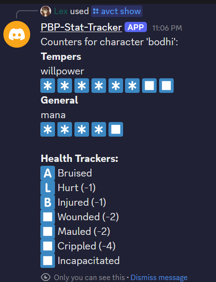

# AVCT Discord Bot

A flexible Discord bot for managing tabletop RPG characters, counters, and health/damage tracking. Built with `discord.py` and pymongo, this bot supports multiple splats (character types), custom counters, health systems, and advanced command autocompletion.

---

## Features

- **Character Management**: Add, list, rename, and remove characters.
- **Counter System**: Track willpower, mana, blood pool, glamour, rage, XP, items, projects, and more.
- **Health Tracking**: Add/remove health trackers (normal/chimerical), apply damage, heal, and display health status.
- **Splat Support**: Sorcerer, Changeling, Vampire, Fera, with splat-specific setup.
- **Autocomplete**: Fast dropdowns for character, counter, category, and splat selection.
- **Debugging**: Output all character/counter/health data for troubleshooting.
- **Permissions**: All commands are per-user; users only see and edit their own data.
- **Public/Private Display**: Option to show character information publicly or privately.

---

## Setup

1. **Clone the repository**  
   `git clone https://github.com/yourusername/avct-discord-bot.git`

2. **Install dependencies**  
   `pip install -r requirements.txt`

3. **Configure environment**  
   Create a `.env` file with:
   ```
   DISCORD_TOKEN=your-bot-token
   MAX_USER_CHARACTERS=10
   MAX_COUNTERS_PER_CHARACTER=50
   MAX_FIELD_LENGTH=32
   MAX_COMMENT_LENGTH=128
   MONGO_CONNECTION_STRING=your-mongodb-connection-string
   MONGO_DB_NAME=your-database-name
   ```

4. **Run the bot**  
   ```
   python main.py
   ```

---

## Command Reference

The commands are now divided into two main categories:
- `/avct` - Essential gameplay commands
- `/configav` - Configuration and management commands

### Essential Commands

- `/avct show <character> [public=False]`  
  Show all counters and health for a character. Set `public` to True to make visible to everyone.



- `/avct plus <character> <counter> [points=1]`  
  Add points to a counter.

- `/avct minus <character> <counter> [points=1]`  
  Remove points from a counter.

- `/avct damage <character> <damage_type> <levels> [chimerical=False]`  
  Add damage to a health tracker. Defaults to normal health, set `chimerical` to True for chimerical damage.

- `/avct heal <character> <levels> [chimerical=False]`  
  Heal damage from a health tracker. Defaults to normal health, set `chimerical` to True for chimerical healing.

### Configuration Commands

#### Character Management
- `/configav character list`  
  List all your characters.

- `/configav character temp <character> <counter> <new_value>`  
  Set the temp value for a counter.

- `/configav character perm <character> <counter> <new_value>`  
  Set the perm value for a counter.

- `/configav character bedlam <character> <counter> <new_value>`  
  Set bedlam for a counter (only for counters of type `perm_is_maximum_bedlam`).

#### Adding Content
- `/configav add character_sorc <character> <willpower> <mana>`  
  Add a Sorcerer character with willpower and mana counters, and a normal health tracker.

- `/configav add character_vampire <character> <blood_pool> <willpower>`  
  Add a Vampire character with blood pool and willpower counters, and a normal health tracker.

- `/configav add character_changeling <character> <willpower_fae> <glamour> <nightmare> <banality>`  
  Add a Changeling character with willpower_fae, glamour, nightmare, banality counters, and both normal and chimerical health trackers.

- `/configav add character_fera <character> <willpower> <gnosis> <rage> <glory> <honor> <wisdom> [honor_replacement] [glory_replacement] [wisdom_replacement]`  
  Add a Fera character with all relevant counters and a normal health tracker.

- `/configav add counter <character> <counter_type> <value> [comment] [name_override]`  
  Add a predefined counter to a character.  
  - For `project_roll` and `item_with_charges`, `name_override` is required.
  - For `glory`, `honor`, `wisdom`, `name_override` can be used to override the counter name.

- `/configav add customcounter <character> <counter> <temp> <perm> [category] [comment]`  
  Add a custom counter to a character.

- `/configav add health <character> <health_type>`  
  Add a health tracker (normal or chimerical) to a character. Only one tracker per type per character.

#### Editing Content
- `/configav edit counter <character> <counter> <field> <value>`  
  Set temp or perm for a counter.

- `/configav edit comment <character> <counter> <comment>`  
  Set the comment for a counter.

- `/configav edit category <character> <counter> <category>`  
  Set the category for a counter.

#### Renaming
- `/configav rename counter <character> <counter> <new_name>`  
  Rename a counter for a character.

- `/configav rename character <character> <new_name>`  
  Rename a character.

#### Removing Content
- `/configav remove character <character>`  
  Remove a character and all its counters.

- `/configav remove counter <character> <counter>`  
  Remove a counter from a character.

- `/configav remove health <character> <health_type>`  
  Remove a health tracker from a character.

#### Debugging
- `/configav debug`  
  Output all properties of all counters and health trackers for all your characters.

---

## Categories

Counters are grouped by the following categories in output:

- **tempers**
- **reknown**
- **general**
- **health**
- **items**
- **other**
- **projects**
- **xp**

---

## Health System

- Health trackers store a list of health levels (Bruised, Hurt, Injured, Wounded, Mauled, Crippled, Incapacitated).
- Damage is tracked as a list of types (Bashing, Lethal, Aggravated).
- Damage and healing commands update the damage list, respecting health track limits.
- Normal and chimerical health trackers are displayed side by side when both exist.

### Health Display

Health is displayed using emoji:
- ◼️ - Empty/undamaged health level
- 🇧 - Bashing damage
- 🇱 - Lethal damage
- 🇦 - Aggravated damage

When both normal and chimerical health are present, a header row with 🟦 🇨 indicates the columns.

---

## Counter Types

- **Single number**: Basic counter with temp and perm values
- **Perm is maximum**: Counter where temp can't exceed perm (used for willpower, etc.)
- **Perm is maximum with bedlam**: Counter with additional bedlam value (used for changeling willpower)
- **Perm not maximum**: Counter where temp and perm are tracked separately

---

## Autocomplete

All commands that take a character, counter, category, or splat use Discord dropdown/autocomplete for fast selection.

---

## Notes

- All data is per-user; users cannot see or edit other users' characters or counters.
- Removing a character also removes all associated counters and health trackers.
- All limits (max characters, counters, field lengths) are configurable in `.env`.
- Health display automatically pairs normal and chimerical health when both exist.

---

## License & Credits

This project is open source. Please keep credits and a link to this repository in all files containing code from this project.

---
